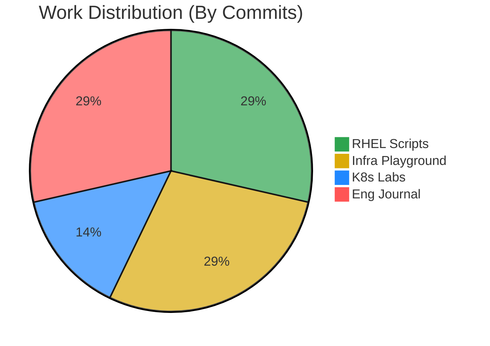

| 📦 Repository | 📊 Weekly Progress | 📈 Status |
| :--- | :--- | :--- |
| **RHEL Scripts** |  | 🚧 **2/4** |
| **Infra Playground** |  | 🚧 **2/3** |
| **K8s Labs** |  | 🚧 **1/5** |
| **Eng Journal** |  | 🚧 **2/7** |

 

  

  

 

  
  
  
  
  
  

  

 

### 🧙‍♂️ About Me

I am a **DevOps enthusiast** and undergraduate at the **University of Moratuwa**. Currently, I am applying my skills as a Trainee Infrastructure Engineer at **MillenniumIT ESP**, focusing on Enterprise Linux and Virtualization.

Examples of my work include **6DOF Robotic Arm control** and **Conveyor Belt inspection systems**.

---

### 🔮 The Arsenal

| **Infrastructure** | **DevOps & CI/CD** | **Scripting** |
| :--- | :--- | :--- |
|  |  |  |
|  |  |  |
|  |  |  |

---

<!-- START_WEEKLY_GOALS -->
### 🎯 Weekly Goal Tracker

| Repository | Weekly Progress | Status |
| :--- | :--- | :--- |
| **Rhel Automation Scripts** | `▓▓▓▓▓▓▓▓▓▓` ✅ **4/4** |
| **Infrastructure Playground** | `▓▓▓▓▓▓▓▓▓▓` ✅ **4/3** |
| **K8S Lab Experiments** | `▓▓░░░░░░░░` 🚧 **1/5** |
| **Engineering Journal** | `▓▓░░░░░░░░` 🚧 **2/7** |

*Last updated: 2025-12-27 19:06*
<!-- END_WEEKLY_GOALS -->

### 📊 Github Stats

  

   
   

  
  

