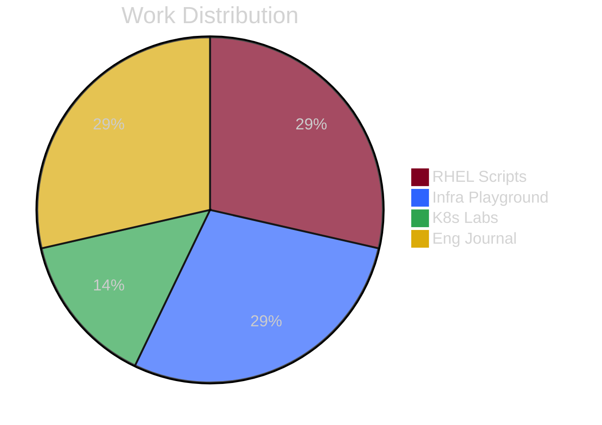

  

  

 

  
  
  
  

 

### 🧙‍♂️ About Me

I am a **DevOps enthusiast** and undergraduate at the **University of Moratuwa**. Currently, I am applying my skills as a Trainee Infrastructure Engineer at **MillenniumIT ESP**, focusing on Enterprise Linux and Virtualization.

Examples of my work include **6DOF Robotic Arm control** and **Conveyor Belt inspection systems**.

---

### 🔮 The Arsenal

<table border="0" width="100%">
    <tr>
        <td width="60%" valign="middle">
            <h4 align="left">☁️ Infrastructure & Virtualization</h4>
            

                
                
                
            

            <h4 align="left">🚀 DevOps & Automation</h4>
            

                
                
                
            

            <h4 align="left">💻 Scripting & Languages</h4>
            

                
                
                
            

        </td>
        <td width="40%" align="center" valign="middle">
            
        </td>
    </tr>
</table>

---

<h3>🚀 Weekly Engineering Velocity</h3>

<i>Last updated: 2025-12-27 20:08 UTC</i>

| Repository | Weekly Progress | % | Status |
| :--- | :--- | :--- | :--- |
| 🚧 **RHEL Scripts** | `██████████░░░░░░░░░░` | **50%** | **2/4** |
| 🚧 **Infra Playground** | `█████████████░░░░░░░` | **66%** | **2/3** |
| 🚧 **K8s Labs** | `████░░░░░░░░░░░░░░░░` | **20%** | **1/5** |
| 🚧 **Eng Journal** | `█████░░░░░░░░░░░░░░░` | **28%** | **2/7** |

### 📊 Github Stats

  
   
   
  
  

